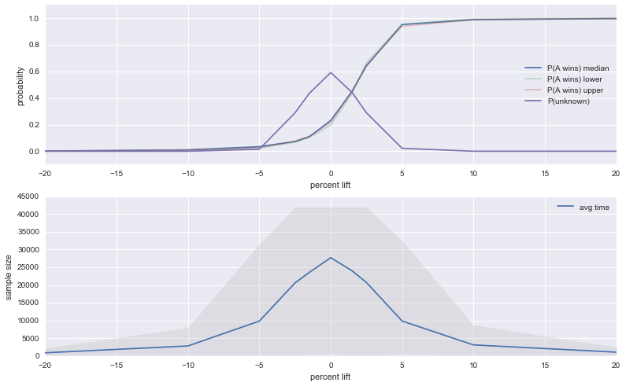
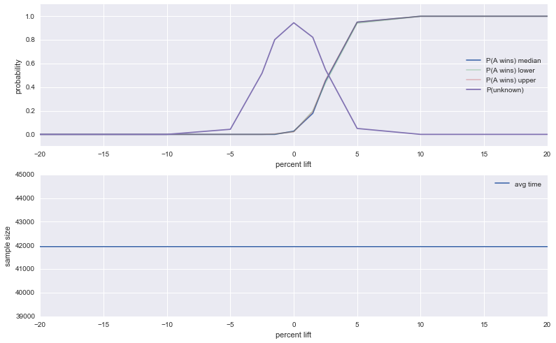
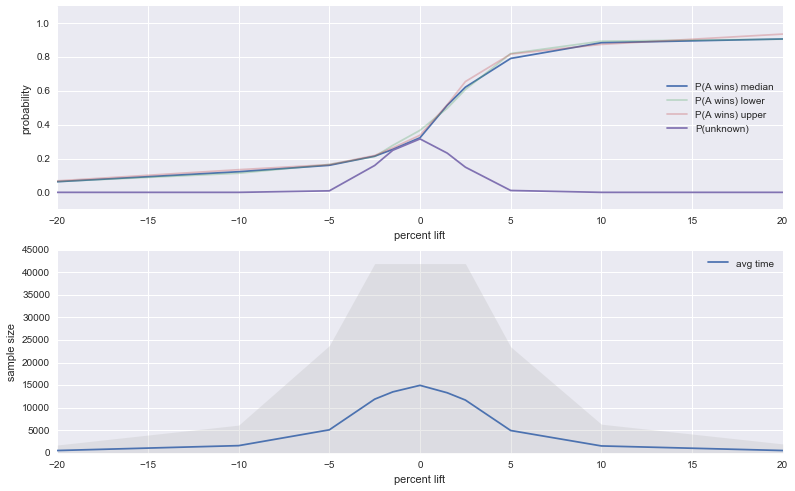
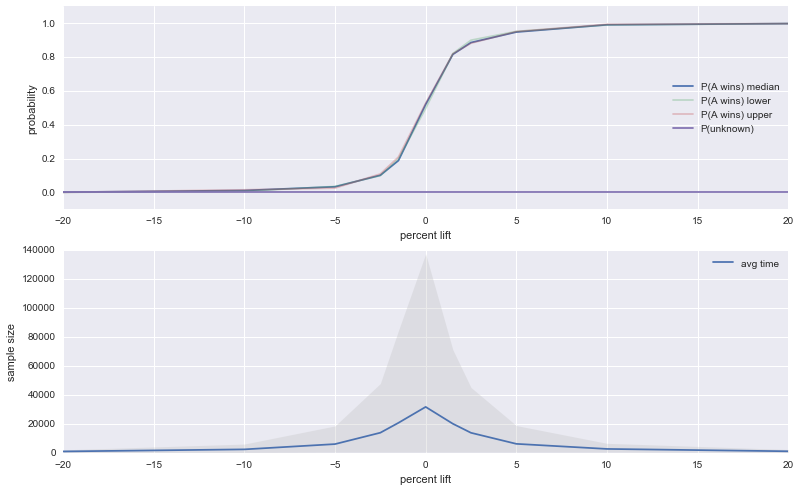
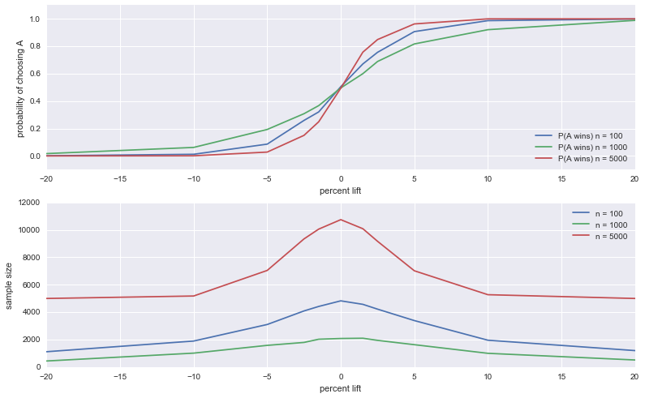

```python
%matplotlib inline
%load_ext autoreload
%autoreload 2
import pandas as pd
import numpy as np
from abtest_util import SimStream, DonationProb, EmpiricalDonationProb
from bayesian_abtest import CostABTest
from nh_abtest import NHABTest, samples_per_branch_calculator
from abstract_abtest import expected_results, expected_results_by_lift, expected_results_by_interval
import seaborn as sns
```


```python
#Define Ground Truth Click Through Rates
# DonationProb class
p_B = DonationProb(0.20)
p_A = DonationProb(0.20)

# Estimate Control CTR From Historical Data
n = 10000000
hist_data_B = SimStream(p_B).get_next_records(n)
p_hat = EmpiricalDonationProb(hist_data_B, p_B.values)
ci =  p_hat.p_donate_ci()
print ("CI over control:",  ci)
```

    CI over control: (0.19972193716638142, 0.19996930000000002, 0.2002175847546166)


```python
n_sims = 1000
lifts = [-0.20, -0.10, -0.05, -0.025, -0.015,0.0, 0.015, 0.025, 0.05, 0.10, 0.20]
alpha = 0.05
max_samples = 41950
```


```python
interval = 250
expected_results_by_lift(NHABTest, [None, None, interval, max_samples, alpha], n_sims, p_hat, lifts)
```

    -0.2
    -0.1
    -0.05
    -0.025
    -0.015
    0.0
    0.015
    0.025
    0.05
    0.1
    0.2





<div>
<table border="1" class="dataframe">
  <thead>
    <tr style="text-align: right;">
      <th></th>
      <th>% lift A over B</th>
      <th>P(Choosing A) Median</th>
      <th>P(Unknown) Median</th>
      <th>Avg Time</th>
    </tr>
  </thead>
  <tbody>
    <tr>
      <th>0</th>
      <td>-20.0</td>
      <td>0.001</td>
      <td>0.000</td>
      <td>887.25</td>
    </tr>
    <tr>
      <th>1</th>
      <td>-10.0</td>
      <td>0.010</td>
      <td>0.000</td>
      <td>2814.00</td>
    </tr>
    <tr>
      <th>2</th>
      <td>-5.0</td>
      <td>0.034</td>
      <td>0.015</td>
      <td>9833.00</td>
    </tr>
    <tr>
      <th>3</th>
      <td>-2.5</td>
      <td>0.073</td>
      <td>0.289</td>
      <td>20601.00</td>
    </tr>
    <tr>
      <th>4</th>
      <td>-1.5</td>
      <td>0.109</td>
      <td>0.435</td>
      <td>23570.50</td>
    </tr>
    <tr>
      <th>5</th>
      <td>0.0</td>
      <td>0.231</td>
      <td>0.592</td>
      <td>27719.75</td>
    </tr>
    <tr>
      <th>6</th>
      <td>1.5</td>
      <td>0.451</td>
      <td>0.441</td>
      <td>24000.00</td>
    </tr>
    <tr>
      <th>7</th>
      <td>2.5</td>
      <td>0.642</td>
      <td>0.289</td>
      <td>20725.00</td>
    </tr>
    <tr>
      <th>8</th>
      <td>5.0</td>
      <td>0.953</td>
      <td>0.022</td>
      <td>9843.75</td>
    </tr>
    <tr>
      <th>9</th>
      <td>10.0</td>
      <td>0.990</td>
      <td>0.000</td>
      <td>3107.50</td>
    </tr>
    <tr>
      <th>10</th>
      <td>20.0</td>
      <td>0.998</td>
      <td>0.000</td>
      <td>1063.75</td>
    </tr>
  </tbody>
</table>
</div>


```python
interval = max_samples+10
expected_results_by_lift(NHABTest, [None, None, interval, max_samples, alpha], n_sims, p_hat, lifts)
```

    -0.2
    -0.1
    -0.05
    -0.025
    -0.015
    0.0
    0.015
    0.025
    0.05
    0.1
    0.2





<div>
<table border="1" class="dataframe">
  <thead>
    <tr style="text-align: right;">
      <th></th>
      <th>% lift A over B</th>
      <th>P(Choosing A) Median</th>
      <th>P(Unknown) Median</th>
      <th>Avg Time</th>
    </tr>
  </thead>
  <tbody>
    <tr>
      <th>0</th>
      <td>-20.0</td>
      <td>0.000</td>
      <td>0.000</td>
      <td>41960.0</td>
    </tr>
    <tr>
      <th>1</th>
      <td>-10.0</td>
      <td>0.000</td>
      <td>0.000</td>
      <td>41960.0</td>
    </tr>
    <tr>
      <th>2</th>
      <td>-5.0</td>
      <td>0.000</td>
      <td>0.043</td>
      <td>41960.0</td>
    </tr>
    <tr>
      <th>3</th>
      <td>-2.5</td>
      <td>0.000</td>
      <td>0.518</td>
      <td>41960.0</td>
    </tr>
    <tr>
      <th>4</th>
      <td>-1.5</td>
      <td>0.000</td>
      <td>0.802</td>
      <td>41960.0</td>
    </tr>
    <tr>
      <th>5</th>
      <td>0.0</td>
      <td>0.027</td>
      <td>0.945</td>
      <td>41960.0</td>
    </tr>
    <tr>
      <th>6</th>
      <td>1.5</td>
      <td>0.178</td>
      <td>0.822</td>
      <td>41960.0</td>
    </tr>
    <tr>
      <th>7</th>
      <td>2.5</td>
      <td>0.451</td>
      <td>0.549</td>
      <td>41960.0</td>
    </tr>
    <tr>
      <th>8</th>
      <td>5.0</td>
      <td>0.950</td>
      <td>0.050</td>
      <td>41960.0</td>
    </tr>
    <tr>
      <th>9</th>
      <td>10.0</td>
      <td>1.000</td>
      <td>0.000</td>
      <td>41960.0</td>
    </tr>
    <tr>
      <th>10</th>
      <td>20.0</td>
      <td>1.000</td>
      <td>0.000</td>
      <td>41960.0</td>
    </tr>
  </tbody>
</table>
</div>


```python
interval = 1
expected_results_by_lift(NHABTest, [None, None, interval, max_samples, alpha], n_sims, p_hat, lifts)
```

    -0.2
    -0.1
    -0.05
    -0.025
    -0.015
    0.0
    0.015
    0.025
    0.05
    0.1
    0.2





<div>
<table border="1" class="dataframe">
  <thead>
    <tr style="text-align: right;">
      <th></th>
      <th>% lift A over B</th>
      <th>P(Choosing A) Median</th>
      <th>P(Unknown) Median</th>
      <th>Avg Time</th>
    </tr>
  </thead>
  <tbody>
    <tr>
      <th>0</th>
      <td>-20.0</td>
      <td>0.063</td>
      <td>0.000</td>
      <td>493.935</td>
    </tr>
    <tr>
      <th>1</th>
      <td>-10.0</td>
      <td>0.122</td>
      <td>0.000</td>
      <td>1577.638</td>
    </tr>
    <tr>
      <th>2</th>
      <td>-5.0</td>
      <td>0.160</td>
      <td>0.009</td>
      <td>5084.710</td>
    </tr>
    <tr>
      <th>3</th>
      <td>-2.5</td>
      <td>0.214</td>
      <td>0.159</td>
      <td>11885.686</td>
    </tr>
    <tr>
      <th>4</th>
      <td>-1.5</td>
      <td>0.254</td>
      <td>0.249</td>
      <td>13499.862</td>
    </tr>
    <tr>
      <th>5</th>
      <td>0.0</td>
      <td>0.323</td>
      <td>0.316</td>
      <td>14949.183</td>
    </tr>
    <tr>
      <th>6</th>
      <td>1.5</td>
      <td>0.515</td>
      <td>0.232</td>
      <td>13299.130</td>
    </tr>
    <tr>
      <th>7</th>
      <td>2.5</td>
      <td>0.622</td>
      <td>0.149</td>
      <td>11686.907</td>
    </tr>
    <tr>
      <th>8</th>
      <td>5.0</td>
      <td>0.792</td>
      <td>0.011</td>
      <td>4931.453</td>
    </tr>
    <tr>
      <th>9</th>
      <td>10.0</td>
      <td>0.885</td>
      <td>0.000</td>
      <td>1511.489</td>
    </tr>
    <tr>
      <th>10</th>
      <td>20.0</td>
      <td>0.907</td>
      <td>0.000</td>
      <td>494.429</td>
    </tr>
  </tbody>
</table>
</div>


```python
interval = 250
cost = 0.0002
expected_results_by_lift(CostABTest, [None, None, interval, float('inf'), cost], n_sims, p_hat, lifts)
```

    -0.2
    -0.1
    -0.05
    -0.025
    -0.015
    0.0
    0.015
    0.025
    0.05
    0.1
    0.2





<div>
<table border="1" class="dataframe">
  <thead>
    <tr style="text-align: right;">
      <th></th>
      <th>% lift A over B</th>
      <th>P(Choosing A) Median</th>
      <th>P(Unknown) Median</th>
      <th>Avg Time</th>
    </tr>
  </thead>
  <tbody>
    <tr>
      <th>0</th>
      <td>-20.0</td>
      <td>0.001</td>
      <td>0.0</td>
      <td>906.00</td>
    </tr>
    <tr>
      <th>1</th>
      <td>-10.0</td>
      <td>0.011</td>
      <td>0.0</td>
      <td>2332.25</td>
    </tr>
    <tr>
      <th>2</th>
      <td>-5.0</td>
      <td>0.033</td>
      <td>0.0</td>
      <td>5976.75</td>
    </tr>
    <tr>
      <th>3</th>
      <td>-2.5</td>
      <td>0.101</td>
      <td>0.0</td>
      <td>13817.25</td>
    </tr>
    <tr>
      <th>4</th>
      <td>-1.5</td>
      <td>0.188</td>
      <td>0.0</td>
      <td>20640.75</td>
    </tr>
    <tr>
      <th>5</th>
      <td>0.0</td>
      <td>0.520</td>
      <td>0.0</td>
      <td>31627.25</td>
    </tr>
    <tr>
      <th>6</th>
      <td>1.5</td>
      <td>0.816</td>
      <td>0.0</td>
      <td>20012.25</td>
    </tr>
    <tr>
      <th>7</th>
      <td>2.5</td>
      <td>0.886</td>
      <td>0.0</td>
      <td>13763.00</td>
    </tr>
    <tr>
      <th>8</th>
      <td>5.0</td>
      <td>0.948</td>
      <td>0.0</td>
      <td>6140.75</td>
    </tr>
    <tr>
      <th>9</th>
      <td>10.0</td>
      <td>0.991</td>
      <td>0.0</td>
      <td>2634.75</td>
    </tr>
    <tr>
      <th>10</th>
      <td>20.0</td>
      <td>0.998</td>
      <td>0.0</td>
      <td>1014.75</td>
    </tr>
  </tbody>
</table>
</div>


```python
cost = 0.001
expected_results_by_interval(CostABTest, [None, None, interval, 40000, cost], n_sims, p_hat, lifts, 100, 1000, 5000)
```

    -0.2
    -0.1
    -0.05
    -0.025
    -0.015
    0.0
    0.015
    0.025
    0.05
    0.1
    0.2




